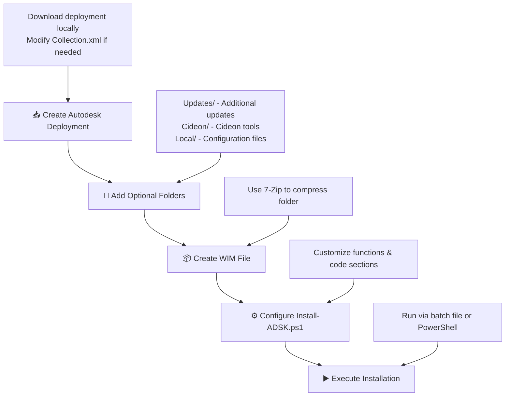

# Install Autodesk Deplyoments with WIM

## 🚀 Workflow

### 📋 **Step-by-Step Guide**



#### **🎯 Step 1: Create Autodesk Deployment**
- 📥 **Download** your Autodesk deployment locally
- 📝 **Copy** the `Collection.xml` and modify it for your needs
  - *Example: Remove AutoCAD to create an Inventor-only deployment*
- 💾 **Save** as custom XML file (e.g., `Inventor_only.xml`)

#### **📁 Step 2: Add Optional Folders** *(Optional)*
Create these **hardcoded folder names** for additional content:

| Folder | Purpose | Content Example |
|--------|---------|----------------|
| 📁 **Updates/** | Product updates | `Update_Inventor_20XX.X.exe` |
| 📁 **Cideon/** | Cideon tools | `CIDEON.Inventor.Toolbox_x64.msi` |
| 📁 **Local/** | Config files | `ProgramData/`, `Users/` folders |

#### **📦 Step 3: Create WIM File**
- 🗜️ **Use 7-Zip** to create a WIM file from your deployment folder
- 📁 **Include** all subfolders (`image/`, `Updates/`, `Cideon/`, `Local/`)
- 💾 **Name** the WIM file descriptively (e.g., `PDC_2024.wim`)

#### **⚙️ Step 4: Configure Install-ADSK.ps1**
The PowerShell script has **two main sections**:

```powershell
#region Functions
# 🔧 Pre-defined commands and utilities
function Install-AutodeskDeployment { ... }
function Install-CideonTool { ... }
# ... 22 total functions
#endregion

#region Code
# 🎯 Your customization area:
# - Install section
# - Uninstall section
# - Update section
#endregion
```

> 💡 **Tip:** All functions are documented within the PS1 file itself!

#### **▶️ Step 5: Execute Installation**
Choose your preferred method:

```powershell
# 🎯 Direct PowerShell execution
.\Install-ADSK.ps1 -WIM "PDC_2024" -Mode "Install" -Logging

# 📦 Via batch file (see samples/ folder)
Install-Example.bat
```

---

### 🎯 **Quick Start Example**

```powershell
# 📍 Navigate to script location
cd \\SERVER\SHARE\ScriptLocation

# 🚀 Run installation with logging and cleanup
.\Install-ADSK.ps1 -WIM "PDC_2024" -Mode "Install" -Path "\\SERVER\SHARE\DEPLOYMENT" -Logging -Purge
```

### ✨ **Pro Tips**

- 🔄 **Version Updates:** Just create a new WIM file for deployment changes
- 📁 **Batch Files:** Check the `samples/` folder for common scenarios
- 🛠️ **Local Copies:** Use `Copy-Local.ps1` for post-installation file copying
- 📝 **Logging:** Always use `-Logging` for troubleshooting

## Sample folder structure
The folder structure is based on the default Autodesk deployments. This could look like this:

```
📁 PDC_20XX                                    # Autodesk deployment name
├── 📁 image/                                  # Default Autodesk deployment
│   ├── 📁 AMECH_PP_20XX_de-DE/
│   │   ├── 📄 setup.xml                       # Products to install
│   │   ├── 📄 setup_ext.xml                   # Updates and language packs
│   │   └── 📄 ...
│   ├── 📁 INVPROSA_20XX_de-DE/
│   ├── 📄 Collection.xml                      # Main deployment config
│   ├── 📄 Inventor_only.xml                   # Modified deployment config
│   └── 📄 ...
│
├── 📁 Updates/                                # Additional updates
│   ├── 🔧 Update_Inventor_20XX.X.exe
│   ├── 🔧 Update_AutoCAD_20XX.X.exe
│   └── 🔧 cer.msi
│
├── 📁 Cideon/                                 # Cideon Tools
│   ├── 📦 CIDEON.VAULT.TOOLBOX.SETUP_XXXX.X.X.XXXXX.msi
│   ├── 📦 CIDEON.VAULT.TOOLBOX.SETUP.SERVICEPACK_XXXX.X.X.XXXXX.msi
│   ├── 📦 CIDEON.Inventor.Toolbox_x64_XXXX.X.X.XXXXX.msi
│   └── 📦 CDN_DataStandards_Setup_XXXX.X.X.XXXXX.msi
│
├── 📁 Local/                                  # Local configuration files
│   ├── 📁 ProgramData/
│   └── 📁 Users/
│       ├── 📁 Public/                         # Public user folder
│       │   └── 📁 Documents/
│       │       └── 📁 CIDEON/
│       │           └── 📁 LicenseFiles/
│       │               └── 📁 20XX/
│       └── 📁 USERNAME/                       # Local user folder (renamed to actual username)
│           └── 📁 AppData/
│               └── 📁 Roaming/
│                   └── 📁 Autodesk/
│
└── ⚡ Install-ADSK.ps1                        # Main installation script
```

### 📋 Folder Descriptions

| Folder | Purpose | Required |
|--------|---------|----------|
| **📁 image/** | Contains the default Autodesk deployment files | ✅ |
| **📁 Updates/** | Additional product updates to install | ❌ |
| **📁 Cideon/** | Cideon-specific tools and extensions | ❌ |
| **📁 Local/** | Local configuration files and user settings | ❌ |
## Create a WIM
Use 7-zip to create a wim File from the deployment folder.

## Change the Install-ADSK.ps1 for your needs
You can find the ps1 in two sections
1. Functions
    - In the Functions area you can find all pre defined commands.
2. Code
    - You can find the "Install", "Uninstall" and "Update" section. Here you can modify your own needs.
All Functions are documented in the ps1 file itself.


## FAQ
### What if I need to change the Autodesk deployment or change/add files?
The fastest way is just to create a new WIM file from the deplyoment folder
<br><br>

### How to call the powershells and with wich parameters?
You can find batch files in the subfolder "samples" for all the basic scenarios.
<br><br>

### How can I copy file to the ProgramData folder or to the Users folder after installation?
Ha, I got you!
For this you can find the Copy-Local.ps1. A sample call you can also find in the samples folder.

This allows you to copy (by default the ProgramData and Users Folder) from the central stored deployment folders.

<h5 a><strong><code>Copy-Local.bat</code></strong></h5>

```cmd
@ECHO OFF
skript="\\vaultsrv\CIDEON\_DPL\Copy-Local.ps1"

powershell.exe -ExecutionPolicy Bypass %skript% -Path "\\vaultsrv\CIDEON\_DPL" -Folder "Users"

REM Default folders are "Users" and "ProgramData"
REM powershell.exe -ExecutionPolicy Bypass %skript% -Path "\\vaultsrv\CIDEON\_DPL"
```
<br><br><br>

### What are the parameters for the Install-ADSK.ps1?
You can find this in the file itself, but here is an overview.

| Parameter | Type | Required | Default | Description |
|-----------|------|----------|---------|-------------|
| **WIM** | String | ✅ | - | Name of the WIM file you want to use |
| **Mode** | String | ✅ | - | Mode to execute: `Install`, `Uninstall`, `Update` |
| **Path** | String | ❌ | Script location | Path to the WIM file. Not needed if WIM is in same folder as script |
| **LocalFolder** | String | ❌ | `C:\Temp` | Local folder where WIM file should be downloaded and mapped |
| **Files** | String Array | ❌ | `@("Collection")` | XML filenames WITHOUT extension for installation. Before each install, `LoggingSettings` in the selected XML is enforced to `Logging=true` and `Path=<LocalFolder>\\Install-ADSK-Deplyoment-<WIM>.log` |
| **Version** | String | ❌ | Auto-extracted | Software version for Cideon tools and logging |
| **Logging** | Switch | ❌ | `$false` | Enable log file creation in local folder |
| **NoDownload** | Switch | ❌ | `$false` | Mount WIM from server instead of copying locally |
| **Purge** | Switch | ❌ | `$false` | Delete WIM file after completion (cannot be combined with `-NoDownload`) |
| **WhatIf** | Switch | ❌ | `$false` | Dry run mode: shows what would happen without making changes |
| **Confirm** | Switch | ❌ | `$false` | Prompts for confirmation before executing actions |
<br><br><br>

### How can I call the Install-ADSK?
```powershell
# Go to the script location
cd \\SERVER\SHARE\ScriptLocation
# Call Installation
## Path is needed because the deployment is stored on another location
## Logging enabled
## Purge enabled (deletes WIM locally)
.\Install-ADSK.ps1 -WIM "PDC_20XX" -Mode "Install" -Path "\\SERVER\SHARE\DEPLOYMENT" -Logging -Purge
```
```powershell
# Call Installation
## Path is not needed, because Install-ADSK.ps1 is parallel to the deployment folder
## Logging enabled
## The WIM will not be downloaded, it will be mounted from the server directly (slower installation)
### Instead of default Collection.xml, the Inventor_only.xml is used
.\Install-ADSK.ps1 -WIM "PDC_20XX" -Mode "Install" -Logging -NoDownload -Files "Inventor_only"
```
```powershell
# Dry run (preview all actions)
.\Install-ADSK.ps1 -WIM "PDC_20XX" -Mode "Install" -Path "\\SERVER\SHARE\DEPLOYMENT" -WhatIf
```
```powershell
# Uninstall mode
.\Install-ADSK.ps1 -WIM "PDC_20XX" -Mode "Uninstall" -Path "\\SERVER\SHARE\DEPLOYMENT" -Logging
```
```powershell
# Update mode
.\Install-ADSK.ps1 -WIM "PDC_20XX" -Mode "Update" -Path "\\SERVER\SHARE\DEPLOYMENT" -Logging
```

## Function Reference

### Overview of all Functions in Install-ADSK.ps1

| Function | Description | Required Parameters | Optional Parameters |
|----------|-------------|-------------------|-------------------|
| **Write-InstallLog** | Writes log entries to file (if logging enabled) | `text` | `Info`, `Fail` |
| **Update-WIMInspectionCache** | Inspects and caches WIM folder/file metadata for later use | `MountedPath` | - |
| **Get-CachedFiles** | Returns cached file-like entries for WhatIf scenarios | `Path`, `OperationText` | `CachedFiles` |
| **Install-Update** | Installs updates from Updates subfolder | - | `Path` |
| **Install-AutodeskDeployment** | Installs Autodesk deployment from Image subfolder | - | `Path` |
| **Uninstall-AutodeskDeployment** | Uninstalls Autodesk deployment | - | `Path`, `Product` |
| **Set-AutodeskDeployment** | Configures Autodesk deployment settings | - | - |
| **Install-CideonTool** | Installs Cideon tools from Cideon subfolder | - | Various Cideon switches |
| **Disable-VaultExtension** | Moves Vault extensions to disable them | - | `Filter`, `Version`, `Keep` |
| **Get-RealUserName** | Gets actual username when running as admin | - | - |
| **Get-UserSID** | Gets user Security Identifier (SID) | - | `UserName`, `DomainUser`, `LocalUser` |
| **Set-InventorProjectFile** | Sets Inventor project file path in registry | - | `Version`, `File` |
| **Remove-UserSystemVariable** | Removes user system environment variables | - | - |
| **Copy-Local** | Copies local configuration files | - | `Path`, `SourceFolder`, `TargetFolder` |
| **Uninstall-Program** | Uninstalls programs by display name/publisher | `DisplayName` OR `Publisher` | `FilterOperator` |
| **Get-InstalledProgram** | Gets list of installed programs | - | `DisplayName`, `Publisher`, `FilterOperator` |
| **Set-CIDEONLanguageVariable** | Sets Cideon language environment variables | - | - |
| **Set-CIDEONVariable** | Sets Cideon environment variables | - | `Version` |
| **Rename-RegistryInstallationPath** | Renames registry installation paths | - | - |
| **Get-WIM** | Downloads/copies WIM file to local machine | `File` | `Folder` |
| **Mount-WIM** | Mounts WIM file to specified path | `File` | `Path` |
| **Dismount-WIM** | Dismounts WIM file | `Name` | `purge`, `all` |
| **Register-WIMDismountTask** | Registers scheduled task for WIM dismount | - | - |
| **Set-AutodeskUpdate** | Configures Autodesk update settings | One of: `Enable`, `ShowOnly`, `Disable` | - |
| **Get-AppLogError** | Retrieves application log errors | - | - |

### Function Categories

#### **Installation & Deployment**
- `Install-AutodeskDeployment`, `Uninstall-AutodeskDeployment`, `Set-AutodeskDeployment`
- `Install-Update`, `Install-CideonTool`

#### **WIM Management**
- `Get-WIM`, `Mount-WIM`, `Dismount-WIM`, `Register-WIMDismountTask`

#### **WIM Inspection & Simulation**
- `Update-WIMInspectionCache`, `Get-CachedFiles`

#### **System Configuration**
- `Set-InventorProjectFile`, `Set-AutodeskUpdate`, `Disable-VaultExtension`
- `Set-CIDEONVariable`, `Set-CIDEONLanguageVariable`

#### **User & System Information**
- `Get-RealUserName`, `Get-UserSID`, `Get-InstalledProgram`, `Get-AppLogError`

#### **File & Registry Operations**
- `Copy-Local`, `Remove-UserSystemVariable`, `Rename-RegistryInstallationPath`

#### **Utilities**
- `Write-InstallLog`, `Uninstall-Program`